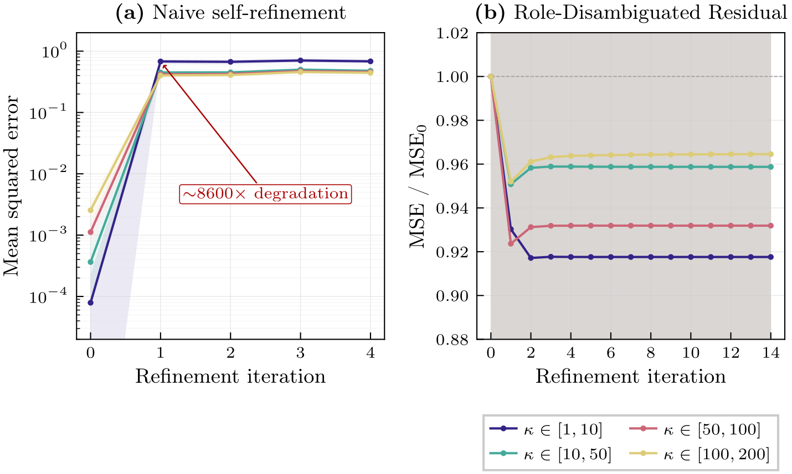
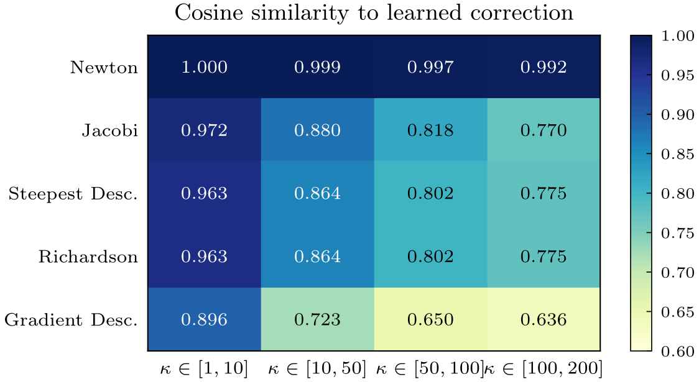

# Self-Refine ICL: Iterative Self-Refinement for In-Context Learning

Transformers trained on in-context learning (ICL) for solving linear systems (Ax = b) fail catastrophically when asked to iteratively refine their own predictions. This project identifies the failure mechanism and proposes **Role-Disambiguated Residual (RDR)**, an architectural fix using role embeddings to distinguish ground-truth solutions from current estimates. We further show that the trained model learns an approximation of Newton's method across all tested condition number ranges.

## Key Findings

**1. Naive self-refinement fails — Role-Disambiguated Residual fixes it.** Feeding the model's prediction back as context causes ~2600x average MSE degradation **(a)**, because the model cannot distinguish its own estimates from ground-truth context examples. By assigning distinct role embeddings to context solutions (OUTPUT) vs. current estimates (VEC_SECONDARY), and training with a dual objective (direct + residual prediction), the model achieves stable, monotonic improvement across all condition number ranges **(b)**, reducing MSE by 4–8% relative to the initial prediction.



| Condition number (κ) | Standard ICL MSE | After 1 refinement | Degradation |
|---|---|---|---|
| 1–10 | 7.9e-05 | 0.679 | 8,600x |
| 10–50 | 3.6e-04 | 0.449 | 1,300x |
| 50–100 | 1.1e-03 | 0.419 | 408x |
| 100–200 | 2.5e-03 | 0.402 | 174x |

**2. The model learns Newton's method.** Hypothesis testing against classical iterative solvers (Richardson, Jacobi, steepest descent, gradient descent, Newton) shows the learned correction aligns with Newton's method (R² > 0.98 across all κ ranges).



| κ range | Best-fit algorithm | Cosine similarity | R² |
|---|---|---|---|
| 1–10 | Newton | 0.9998 | 0.9994 |
| 10–50 | Newton | 0.9991 | 0.9981 |
| 50–100 | Newton | 0.9968 | 0.9947 |
| 100–200 | Newton | 0.9922 | 0.9864 |

## Method

**Token composition:**
```
token = embed_component(data) + embed_role(role)
```

**Refinement loop:**
```python
x_0 = f(context, query)                  # Initial prediction (standard ICL)
x_{k+1} = x_k + f(context, query, x_k)  # Iterative refinement
```

The model is trained with a dual loss:
- **L_direct**: predict the solution x* from context
- **L_residual**: predict the correction (x* - x̃) given a noisy estimate x̃ marked with VEC_SECONDARY role

## Quick Start

```bash
pip install torch numpy scipy

# 1. Demonstrate naive refinement failure
python experiments/section1_phenomenon/naive_refinement_failure.py --device cuda

# 2. Train Role-Disambiguated Residual model
python experiments/section2_solution/role_disambiguated_residual.py --device cuda

# 3. Run full comparison (Baseline vs. Iterative Supervision vs. RDR)
python experiments/section2_solution/run_comparison.py --device cuda

# 4. Algorithm hypothesis testing
python experiments/section3_analysis/hypothesis_tests.py --device cuda

# 5. Classical solver comparison and extrapolation
python experiments/section4_bonus/classical_solvers.py --device cuda

# Run tests
python -m pytest tests/ -v
```

## Configuration

Default hyperparameters (see `experiments/section2_solution/role_disambiguated_residual.py`):

| Parameter | Value |
|---|---|
| Vector/matrix dimension (d) | 4 |
| Transformer hidden dim | 128 |
| Layers / heads | 6 / 4 |
| Training steps | 50,000 |
| Residual weight (λ) | 0.5 |
| Context examples | 5 |
| Condition number range (κ) | 1–100 |

## Requirements

- Python 3.8+
- PyTorch
- NumPy
- SciPy
